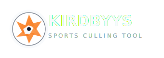

# Kirdbyys Sports Culling Tool

**AI-Powered Sports Photography Analysis & Culling Platform** — fully local, free, and auto-optimized for NVIDIA, AMD, Intel, and Apple hardware.



---

## What It Does

Kirdbyys analyzes thousands of sports photographs and automatically identifies the most publishable images. It is designed for professional sports photographers who need to cull large match galleries quickly without cloud dependencies or subscription fees.

### Core Capabilities

- **Import** folders of 200–2,000+ images (JPG, PNG, TIFF, RAW formats)
- **AI Analysis** of every image: technical quality, composition, action, and storytelling
- **Soccer-Specific Intelligence**: goals, celebrations, saves, tackles, headers, emotional reactions, crowd reactions
- **Ranking**: weighted scoring with explainable results
- **Duplicate & Burst Detection**: suppresses near-identical frames and selects the strongest
- **Selection**: choose Top 10, Top 20, Top 50, Top 100, or custom counts
- **Export**: copy/move files, CSV, Excel, XMP sidecars, PDF reports
- **Lightroom Integration**: writes star ratings and color labels back to XMP sidecars
- **Hardware Auto-Detect**: automatically uses NVIDIA CUDA/TensorRT, AMD ROCm, Intel OpenVINO, Apple CoreML, or CPU

---

## Quick Start

### Requirements

- **OS**: Fedora Linux (also works on Windows, macOS, Ubuntu)
- **CPU**: 4+ cores recommended
- **RAM**: 16 GB minimum, 32 GB recommended for 2,000+ images
- **GPU**: AMD Radeon integrated or discrete (optional; CPU fallback works)
- **Python**: 3.10 or newer

### Installation

Kirdbyys works on **Fedora Linux**, **Ubuntu/Debian**, **Windows 10/11**, and **macOS**. It auto-detects your CPU/GPU and uses the best available provider.

For detailed, platform-specific instructions, see:

📖 **[Full Installation Guide](docs/INSTALLATION.md)**

#### Quick-start (Fedora / Ubuntu / macOS)

```bash
cd kirdbyys-sports-culling
python3 -m venv .venv
source .venv/bin/activate
pip install --upgrade pip
pip install -r requirements.txt

# Optional: install GPU-specific onnxruntime for your hardware
#   NVIDIA: pip install onnxruntime-gpu
#   AMD Linux: pip install onnxruntime-rocm
#   AMD/Intel Windows: pip install onnxruntime-directml
#   Intel: pip install onnxruntime-openvino

python scripts/setup_models.py
python -m kirdbyys
```

Then open **http://127.0.0.1:7840** in your browser.

### Using the App

1. Click **Create New Project** and select your source photo folder.
2. Kirdbyys imports the images and begins AI analysis automatically.
3. Go to the **Rankings** tab to see the top-scored images.
4. Adjust the weights (Technical / Action / Story / Composition) and click **Re-rank**.
5. Review duplicates in the **Duplicates** tab.
6. Review your final selections in the **Final Selection** tab.
7. Export your final selection in the **Export** tab.

### Verify Installation

```bash
python verify_setup.py
```

---

## Project Structure

```
kirdbyys-sports-culling/
├── kirdbyys/
│   ├── config.py               # App settings and paths
│   ├── main.py                 # FastAPI entry point
│   ├── api/
│   │   └── routes.py           # REST API routes
│   ├── core/
│   │   ├── database.py         # SQLAlchemy models
│   │   ├── pipeline.py         # End-to-end analysis pipeline
│   │   └── job_manager.py      # Async background jobs
│   ├── ai/
│   │   ├── models.py           # ONNX model loader / hardware providers
│   │   ├── hardware.py         # CPU/GPU architecture detection
│   │   ├── detectors.py        # YOLO detection + soccer moment classifier
│   │   ├── analyzers.py        # Technical / composition / action analyzers
│   │   ├── ranking.py          # Weighted ranking engine
│   │   ├── duplicate.py        # Perceptual hash duplicate detection
│   │   └── sports.py           # Sport adapter base classes
│   ├── services/
│   │   ├── import_service.py   # Folder import
│   │   ├── export_service.py   # Export formats
│   │   └── lightroom.py        # XMP sidecar integration
│   └── ui/                     # Frontend (HTML/CSS/JS + logos)
├── scripts/
│   └── setup_models.py         # Download ONNX models
├── docs/                       # Full architecture & guides
├── tests/                      # Test suite
├── requirements.txt
└── README.md
```

---

## Hardware Optimization

Kirdbyys automatically detects your CPU/GPU architecture and selects the best ONNX Runtime execution provider:

| Vendor | Windows | Linux | macOS |
|--------|---------|-------|-------|
| NVIDIA | CUDA / DirectML / TensorRT | CUDA / TensorRT | — |
| AMD | DirectML | ROCm / OpenVINO | — |
| Intel | OpenVINO / DirectML | OpenVINO | OpenVINO |
| Apple | — | — | CoreML / CPU |

Provider priority is: **TensorRT → CUDA → ROCm → MIGraphX → OpenVINO → DirectML → CoreML → OpenCL → CPU**. You can disable any provider in `.env`.

On the target AMD Ryzen 7 7840U + Radeon 780M running Fedora Linux, Kirdbyys will try ROCm first, then OpenVINO, then a highly optimized CPU fallback.

---

## Local-Only Guarantee

Kirdbyys does **not** use:

- OpenAI / Claude / Gemini / Anthropic APIs
- AWS Rekognition / Google Vision / Azure Vision
- Any SaaS, credit, or subscription service

All models run on your machine. No internet is required after the initial model download.

---

## Documentation

Full documentation is in the `docs/` folder:

- [Architecture](docs/ARCHITECTURE.md)
- [Model Selection & Justification](docs/MODEL_SELECTION.md)
- [Training Strategy](docs/TRAINING_STRATEGY.md)
- [Dataset Recommendations](docs/DATASET_RECOMMENDATIONS.md)
- [Scoring Algorithm](docs/SCORING_ALGORITHM.md)
- [Duplicate Detection](docs/DUPLICATE_DETECTION.md)
- [Database Schema](docs/DB_SCHEMA.md)
- [API Design](docs/API_DESIGN.md)
- [Optimization Guide](docs/OPTIMIZATION_GUIDE.md)
- [Testing Strategy](docs/TESTING_STRATEGY.md)
- [Roadmap](docs/ROADMAP.md)

---

## License

Kirdbyys Sports Culling Tool is released under the MIT License for personal and professional use.
